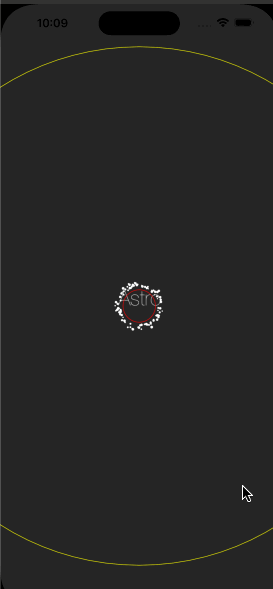

Astrofield
===

An example SpriteKit project for spawning objects on a random point on a circle, and moving them towards the screen for creating a 2D astroid-field like animation.  

You can experiment with the constants on the top of the AstroScene for creating different animation styles. 

Tap to the screen for spawning objects on the example project. 

Demo
---

